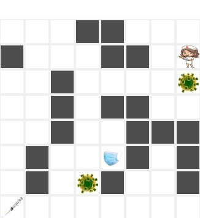

## Corona Apocalypse   

**Game program based on OO design pattern that feature a maze and
solve it by Artificial Intelligence method as - Expectimax and Monte Carlo tree search.**

<b> The agents</b>: 

* Expectimax
* Monte Carlo tree search

<b>To run the game</b>: 

The program get tree arguments, and the fourth argument is optional.

* The board size, can be 4/8/12/16.
* The number of corona viruses. Boards in size 4/8 can have at most 2 corona viruses, and boards in size 12/16 can have at most 3 corona viruses.
* The palyer. It can be one of the agents: Expectimax and MonteCarlo, or Interactive, which means you can play the game using the kyboard ('s'-down, 'w'-up, 'a'-left, 'd'-right).
* Optional: you can use simpleDisplay mode. In that case the game wont use the GUI, and the program will print the board state according to the following signs:
 	- '-' empty box
 	- '*' a wall
 	- '0' The player
	- '1/2/3' corona viruses
 	- 'm' mask
 	- 't' the target (vaccine)

